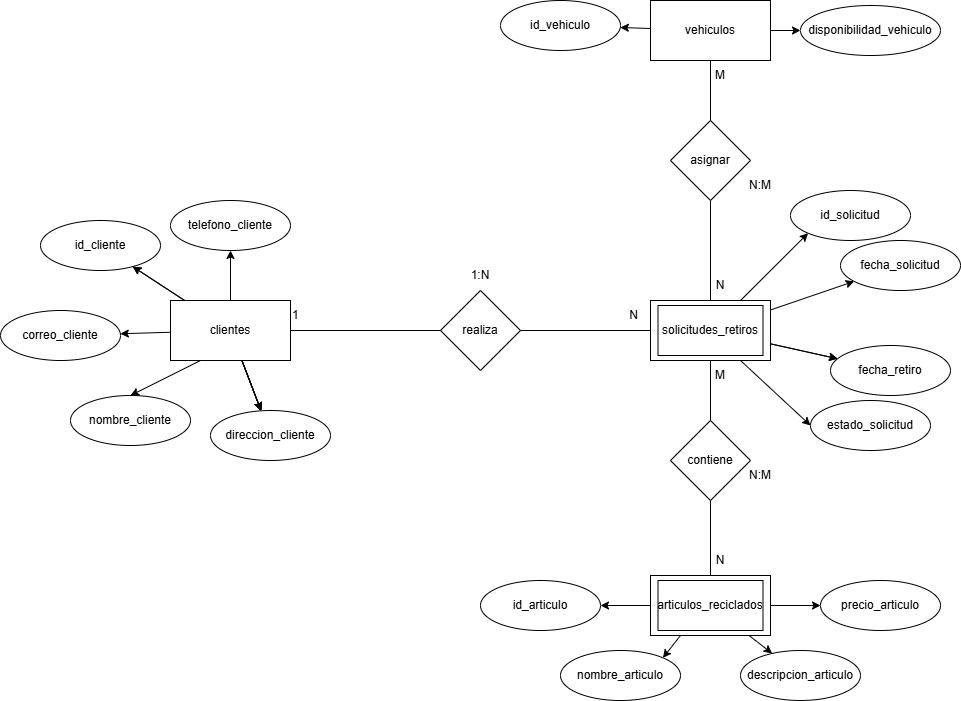

    
# Sistema de Gestión de Reciclaje "Eco-Electrónicos"

Eco-Electrónicos es un proyecto de sistema web diseñado para gestionar la recolección y el reciclaje de residuos electrónicos. La plataforma proporciona una interfaz sencilla para que los usuarios soliciten el retiro de sus artículos a domicilio y permite a la administración llevar un control eficiente de estas solicitudes.

## ✨ Características Principales

-   **Formulario de Solicitud de Retiro:** Interfaz web intuitiva para que los clientes agenden el retiro de sus artículos electrónicos.
-   **Validación de Datos:** El formulario valida con JavaScript que la fecha de retiro sea siempre posterior al día actual.
-   **Visualización de Registros:** La página principal incluye una tabla que muestra el estado de las solicitudes de reciclaje (Pendiente, En Proceso, Completada).
-   **Base de Datos Relacional:** El sistema se apoya en una estructura de base de datos SQL robusta para almacenar información sobre clientes, artículos, solicitudes y vehículos.
-   **Modelo de Datos Documentado:** Se incluye un Diagrama Entidad-Relación (ERD) que ilustra visualmente la estructura de la base de datos.

## 🛠️ Tecnologías Utilizadas

-   **Frontend:**
    -   HTML5
    -   CSS3
    -   JavaScript
    -   Bootstrap 5.3
-   **Base de Datos:**
    -   SQL (Script compatible con MySQL)

## 📊 Modelo de la Base de Datos

El núcleo del sistema es su base de datos relacional, diseñada para gestionar eficientemente toda la información. El esquema completo está definido en el archivo `eco_electronicos.sql`.

Las tablas principales son:
-   `clientes`: Almacena la información de los usuarios.
-   `solicitudes_retiros`: Registra cada solicitud con su fecha y estado.
-   `articulos_reciclados`: Cataloga los tipos de artículos que se pueden reciclar.
-   `vehiculos`: Gestiona la flota de vehículos disponibles para los retiros.
-   Tablas intermedias (`solicitudes_articulos`, `vehiculos_solicitudes`) para gestionar las relaciones.

#### Diagrama Entidad-Relación (ERD)


## 📁 Estructura del Proyecto

El repositorio contiene los siguientes archivos clave:
 

.
├── assets/
│ └── css/
│ └── style.css
├── eco_electronicos.drawio.png
├── eco_electronicos.erd
├── eco_electronicos.html
├── eco_electronicos.sql
└── README.md
    
## 🚀 Puesta en Marcha

Para ejecutar este proyecto en un entorno local, sigue estos pasos:

1.  **Clonar el repositorio:**
    ```bash
    git clone https://github.com/tu-usuario/tu-repositorio.git
    ```

2.  **Configurar la Base de Datos:**
    -   Asegúrate de tener un servidor de bases de datos MySQL (o compatible) en funcionamiento.
    -   Crea una nueva base de datos llamada `eco_electronicos`.
    -   Ejecuta el script del archivo `eco_electronicos.sql` para crear la estructura de tablas.

3.  **Visualizar la Aplicación:**
    -   Abre el archivo `eco_electronicos.html` en tu navegador web preferido.
